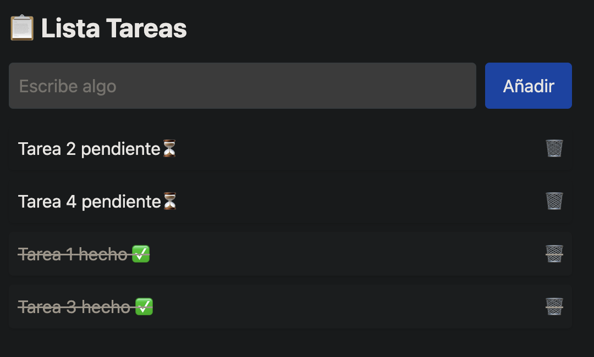

# Clase 27 – App de Tareas (Frontend) – Versión Modularizada 🧩

## 🧠 OBJETIVO GENERAL

Crear una interfaz React modular que:

- ✅ Muestre tareas desde la API
- ✅ Permita añadir tareas nuevas
- ✅ Permita marcar tareas como hechas o pendientes
- ✅ Permita eliminar tareas
- ✅ Esté organizada por componentes reutilizables

## ️REQUISITOS PREVIOS

```
1. Tener corriendo el backend (main.py)
2. API funcionando en http://localhost:8000
3. Proyecto React creado con Vite + Tailwind
4. ENDPOINTS funcionando: GET, POST, PUT, DELETE
```

## 🧪 Pruebas de API FastAPI con curl

| Método | Endpoint                  | Código curl                                                        | Respuesta esperada      |
|--------|---------------------------|---------------------------------------------------------------------|-------------------------|
| GET    | `/tareas`                 | `curl http://localhost:8000/tareas`                                 | Lista de tareas         |
| POST   | `/tareas`                 | `curl -X POST -H "Content-Type: application/json" -d '{"titulo":"Leer"}' http://localhost:8000/tareas` | Tarea creada            |
| PUT    | `/tareas/1`               | `curl -X PUT -H "Content-Type: application/json" -d '{"done":true}' http://localhost:8000/tareas/1`     | Tarea actualizada       |
| DELETE | `/tareas/1`               | `curl -X DELETE http://localhost:8000/tareas/1`                     | Sin contenido (204)     |

## 1. 🏗️ ESTRUCTURA BÁSICA DEL PROYECTO FRONTEND

```
📁 src/
├── App.jsx
├── components/
│   ├── Formulario.jsx
│   └── ListaTareas.jsx
```

## 2. 📄 CREAR COMPONENTES REUTILIZABLES

| Componente         | Descripción                                     | Snippet sugerido                      |
|--------------------|--------------------------------------------------|----------------------------------------|
| `App.jsx`          | Orquesta todo. Llama al fetch inicial            | `react-base-app`, `React-fetch-loadTareas` |
| `Formulario.jsx`   | Formulario con input y botón para añadir tareas | `React-estado-input`, `React-crear-tarea-POST` |
| `ListaTareas.jsx`  | Lista de tareas con toggle y botón eliminar     | `React-lista-tareas-toggle-delete`     |

## 🧩 EJEMPLO DE CONTEXTO – De Genérico a Real

| Genérico     | ¿Qué significa?               | En tu proyecto         |
|--------------|-------------------------------|------------------------|
| `valor`      | Texto del input                | `titulo`               |
| `setValor`   | Función para actualizar input  | `setTitulo`            |
| `items`      | Lista a renderizar             | `tareas`               |
| `setItems`   | Función para modificar lista   | `setTareas`            |
| `toggleItem` | Función para cambiar estado    | `toggleTarea`          |

## 3. 🧠 Tabla de conceptos – App de Tareas

| Concepto         | Explicación                                            |
|------------------|--------------------------------------------------------|
| `useState`       | Guardar estados locales (`tareas`, `titulo`)          |
| `useEffect`      | Cargar datos al montar el componente (`fetch`)        |
| `.map()`         | Recorrer las tareas para renderizarlas                |
| `onSubmit`       | Manejar el envío del formulario                       |
| `onClick`        | Ejecutar funciones (toggle / delete) al pulsar        |

## 4. ✅ CHECKLIST DE APRENDIZAJE

- [x] Entiendo cómo crear componentes en React
- [x] Sé cómo hacer peticiones GET y POST
- [x] Puedo actualizar estado tras una operación (añadir / borrar)
- [x] Sé modularizar componentes y pasarles props

## 5. 💪 EJERCICIOS PROPUESTOS – App de Tareas

### ✅ EJERCICIO 1: Mostrar tareas desde la API
```jsx
useEffect(() => {
  fetch("http://localhost:8000/tareas")
    .then((res) => res.json())
    .then((data) => setTareas(data));
}, []);
```

### ✅ EJERCICIO 2: Añadir nueva tarea con formulario
Snippet: `React-crear-tarea-POST`

### ✅ EJERCICIO 3: Marcar tarea como hecha (toggle PUT)
```js
const toggleTarea = async (id, done) => {
  const res = await fetch(`http://localhost:8000/tareas/${id}`, {
    method: "PUT",
    headers: { "Content-Type": "application/json" },
    body: JSON.stringify({ done: !done }),
  });

  if (res.ok) {
    const actualizada = await res.json();
    setTareas((prev) => prev.map((t) => (t.id === id ? actualizada : t)));
  }
};
```

### ✅ EJERCICIO 4: Ordenar tareas por estado (pendientes arriba)
```js
const tareasOrdenadas = [...tareas].sort((a, b) => Number(a.done) - Number(b.done));
```

## 🧩 ARCHIVOS MODULARIZADOS

### 📄 App.jsx
```jsx
import { useState, useEffect } from "react";
import Formulario from "./components/Formulario";
import ListaTareas from "./components/ListaTareas";

export default function App() {
  const [tareas, setTareas] = useState([]);

  useEffect(() => {
    fetch("http://localhost:8000/tareas")
      .then((res) => res.json())
      .then((data) => setTareas(data));
  }, []);

  return (
    <div className="p-8 max-w-xl mx-auto">
      <h1 className="text-2xl font-bold mb-4">📋 Lista de Tareas</h1>
      <Formulario setTareas={setTareas} />
      <ListaTareas tareas={tareas} setTareas={setTareas} />
    </div>
  );
}
```

### 📄 Formulario.jsx
```jsx
import { useState } from "react";

export default function Formulario({ setTareas }) {
  const [titulo, setTitulo] = useState("");

  const crearTarea = async (e) => {
    e.preventDefault();
    const nueva = { titulo, done: false };

    const res = await fetch("http://localhost:8000/tareas", {
      method: "POST",
      headers: { "Content-Type": "application/json" },
      body: JSON.stringify(nueva),
    });

    if (res.ok) {
      const creada = await res.json();
      setTareas((prev) => [...prev, creada]);
      setTitulo("");
    }
  };

  return (
    <form onSubmit={crearTarea} className="mb-4 flex gap-2">
      <input
        value={titulo}
        onChange={(e) => setTitulo(e.target.value)}
        placeholder="Escribe algo"
        className="border p-2 w-full rounded"
        required
      />
      <button className="bg-blue-500 text-white px-4 py-2 rounded">Añadir</button>
    </form>
  );
}
```

### 📄 ListaTareas.jsx
```jsx
export default function ListaTareas({ tareas, setTareas }) {
  const toggleTarea = async (id, done) => {
    const res = await fetch(`http://localhost:8000/tareas/${id}`, {
      method: "PUT",
      headers: { "Content-Type": "application/json" },
      body: JSON.stringify({ done: !done }),
    });

    if (res.ok) {
      const actualizada = await res.json();
      setTareas((prev) =>
        prev.map((t) => (t.id === id ? actualizada : t))
      );
    }
  };

  const borrarTarea = async (id) => {
    const res = await fetch(`http://localhost:8000/tareas/${id}`, {
      method: "DELETE",
    });
    if (res.ok) {
      setTareas((prev) => prev.filter((t) => t.id !== id));
    }
  };

  const tareasOrdenadas = [...tareas].sort(
    (a, b) => Number(a.done) - Number(b.done)
  );

  return (
    <ul className="space-y-2">
      {tareasOrdenadas.map((t) => (
        <li
          key={t.id}
          className={`p-2 rounded shadow flex justify-between items-center ${
            t.done ? "line-through text-gray-500 bg-gray-50" : "bg-white"
          }`}
        >
          <span
            onClick={() => toggleTarea(t.id, t.done)}
            className="cursor-pointer flex-1"
          >
            {t.titulo} {t.done ? "✅" : "⏳"}
          </span>
          <button
            onClick={() => borrarTarea(t.id)}
            className="text-red-500 hover:text-red-700 ml-2"
          >
            🗑️
          </button>
        </li>
      ))}
    </ul>
  );
}
```
